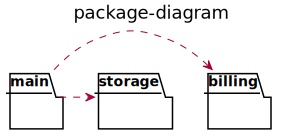

# pkgdiagram
pkgdiagram is a tool to analyze package dependencies of Go and generate UML of package diagrams.

## 🚧 Work in Progress! 🚧
   
Please note that this plugin is currently in alpha stage and still under active development.
We encourage everyone to try it and give feedback, but we don't recommend it for production use yet.

## Example output

## Getting Started

TODO
